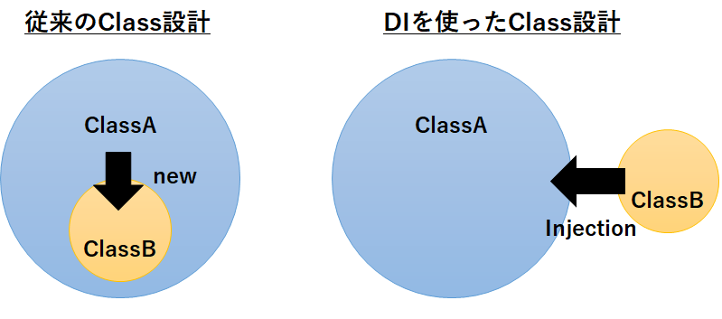
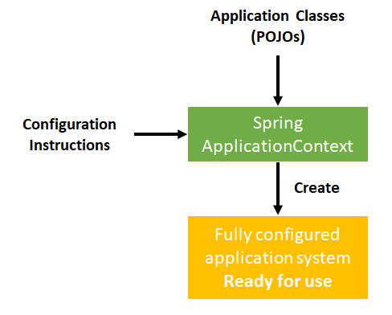
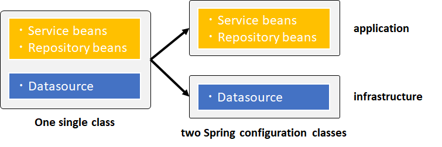

# Spring Conteiner, Dependency Injection
## Dependency Injectionとその利点
Dependency Injection (DI)は「依存性の注入」と訳される。  
必要なインスタンス（依存性）を**外から代入**することで、各モジュールが疎結合になるように設計する。  
硬い言葉で表現すると、あるオブジェクトに対して、利用（依存）しているオブジェクトを注入することで、オブジェクト間の依存関係を作成する。



DIを行うメリットとしては、
* クラス間・Layer間を疎結合化できる。
* Unitテストがしやすくなる（Testabilityの向上）
* インスタンスの差し替えなどが可能となる（例えば、テスト時に開発系・テスト系・本番系のデータアクセスクラスを用意してDIしたり）。

などが挙げられる。

### Spring FrameworkにおけるDIの方法
1. Javaコンフィグファイル
2. アノテーション
3. XML (→古いのでほとんど使われない)

::: danger 注意
XMLによる設定はすでにレガシーなので、原則的には使わないようにしましょう。
:::

### 参考
[初めてでも30分で分かるSpring 5 & Spring Boot 2オーバービュー](https://www.slideshare.net/masatoshitada7/30spring-5-spring-boot-2-103523666)

## パターン・アンチパターンとは。DIとはパターンなのか？
アンチパターンとは、推奨されない設計のことを指す。  
DIも設計パターンの一部と言える。

従来型のクラス設計（Servlet、ビジネスロジック、DAO、DTO）は、お互いが密結合になりがち。
結果として、改修を重ねるごとに改修の難易度が増す（ビジネスロジックの複雑化・肥大化が原因の1つ）。

DIを利用したクラス設計を行うことで、上記の各クラスが疎結合化し、関心事の分離が可能となる。
結果として、コードがスッキリする。

## インターフェイスとその利点
DIを行う上で、インターフェイスの用意は必須と言える。

（DIの利点ではないが）インターフェイスを用意することで、ポリモーフィズムの活用などでメリットが生まれる。

### 1. JDK Proxy
インターフェイスを実装したクラスにインジェクション（Spring FrameworkだとこちらがDefault。インターフェイス持たないクラスの場合、CGlib Proxyに処理を委譲する仕組みになっている）  
当たり前だが、インターフェイスを持たないクラスをProxy化することはできない。

### 2. CGlib Proxy
スーパークラスを継承したクラスにインジェクション（Spring BootだとこちらがDefault）  
スーパークラス側で`final`のついたクラス・メソッドは継承・オーバーライドができないため、それらのクラスはProxy化することができない。

## Spring beansでインターフェイスの利用が推奨される理由
Spring FrameworkではJDK Proxyがデフォルトとなっており、JDK ProxyによるProxy生成の前提条件として、インターフェースの実装があるため。

## application-contextとはSpringが管理するコンテナのこと
SpringのConfigurationクラスやApplicationクラスをインスタンス化する（これらインスタンスのことをBeanと呼ぶ）と、SpringのコンテナであるApplicationContext下で管理される。



Applicationクラスの例。
```java
public class TransferServiceImpl implements TransferService {
    // Needed to perform moneytransfers between accounts
    public TransferServiceImpl(AccountRepository ar) {
        this.accountRepository = ar;
    }
}

public class JdbcAccountRepository implements AccountRepository {
    // Needed to load accounts from the database
    public JdbcAccountRepository(DataSource ds) {
        this.dataSource = ds;
    }
}
```

Configurationクラス（Configuration Instructions）の例。
```java
@Configuration
public class ApplicationConfig{
    @Bean
    public TransferService transferService(){
        return new TransferServiceImpl(accountRepository());
    }

    @Bean
    public AccountRepository accountRepository(){
        return new JdbcAccountRepository(dataSource());
    }

    @Bean
    public DataSource dataSource(){
        BasicDataSource dataSource = New BasicDataSource();
        dataSource.setDriverClassName("org.postgresql.Driver");
        dataSource.setUrl("jdbc:postgresql://localhost/transfer");
        dataSource.setUsername("user");
        dataSource.setPassword("password");
        return dataSource;
    }
}
```

実行クラスの例。
```java
// Create the application from the configuration
ApplicationContext context = 
    SpringApplication.run( ApplicationConfig.class );

// Look up the application service interface
// "transferService"がBean IDとなる。
TransferService service = 
    context.getBean(“transferService”, TransferService.class);

// Use the application
service.transfer(new MonetaryAmount(“300.00”), “1”, “2”);
```

BeanへのアクセスはBean IDがユニークである場合に限り、以下のようにBean IDを省略できる（基本的に、Bean IDはユニークであるように設計するため、以下の書き方が一般的）。
```java
// No need for bean id if type is unique
TransferService ts3 = context.getBean(TransferService.class);
```

### JUnitのテストクラス作成（DIしない場合の例）
```java
public class TransferServiceTests {

    private TransferService service;

    @BeforeEach
    public void setUp() {
        // Create the application from the configuration
        ApplicationContext context =
            SpringApplication.run( ApplicationConfig.class );

        // Look up the application service interface
        service = context.getBean(TransferService.class);
    }

    @Test public void moneyTransfer() {
        Confirmation receipt =
            service.transfer(new MonetaryAmount("300.00"), "1", "2"));

        Assert.assertEquals("500.00", receipt.getNewBalance());
    }
}
```

## 複数ファイルからApplicationContextを作成する
`@Configuration`アノテーションを付けたクラスは長くなりがちなので、分割しておくことができる。

特定のConfigクラスを読み込むには、`@Import`アノテーションをつけて、読み込むクラス名を指定する。

大元のConfigクラス。`ApplicationConfig`クラスと`WebConfig`クラスをインポートしている。
```java
@Configuration
@Import({ApplicationConfig.class, WebConfig.class })
public class InfrastructureConfig {
    ...
}
```

インポートされるConfigクラスたち。
```java
@Configuration
public class ApplicationConfig {
    ...
}

@Configuration
public class WebConfig {
    ...
}
```

`Application` Beansと`Infrastructure` Beansを分離しておくのがBest Practices。



以下に２つに分割する前の例を示す。

```java
@Configuration
public class ApplicationConfig{
    @Bean
    public TransferService transferService(){
        return new TransferServiceImpl(accountRepository());
    }

    @Bean
    public AccountRepository accountRepository(){
        return new JdbcAccountRepository(dataSource());
    }
------------------------------------------------------------------
    @Bean
    public DataSource dataSource(){
        BasicDataSource dataSource = New BasicDataSource();
        dataSource.setDriverClassName("org.postgresql.Driver");
        dataSource.setUrl("jdbc:postgresql://localhost/transfer");
        dataSource.setUsername("user");
        dataSource.setPassword("password");
        return dataSource;
    }
}
```

以下に分割後の例を示す。  
`ApplicationConfig`クラス内のBeanは、インポート先の`TestInfrastructureConfig`クラスのDataSourceのBeanに依存している。

DataSourceのBeanを使うために、`@Autowired`アノテーションを使って、別のconfigクラスのBeanを取得する（これをインジェクションという）。コンストラクタでインジェクションするのが普通。
```java{4,6}
@Configuration
public class ApplicationConfig {

    private final DataSource dataSource;

    @Autowired
    public ApplicationConfig(DataSource ds) {
        this.dataSource = ds;
    }

    @Bean 
    public TransferService transferService() {
        return new TransferServiceImpl ( accountRepository() );
    }

    @Bean 
    public AccountRepository accountRepository(DataSource dataSource) {
        return new JdbcAccountRepository( dataSource );
    }
}
```
```java{2}
@Configuration
@Import(ApplicationConfig.class)
public class TestInfrastructureConfig {
    @Bean 
    public DataSource dataSource() {
        ...
    }
}
```

## 


## [WIP] 積み残し課題
* What is the concept of a “container” and what is its lifecycle?
* How are you going to create a new instance of an ApplicationContext?
* Can you describe the lifecycle of a Spring Bean in an ApplicationContext?
* How are you going to create an ApplicationContext in an integration test test?
* What is the preferred way to close an application context? Does Spring Boot do this for you?
* Dependency injection using annotations (@Component, @Autowired)?
* Component scanning, Stereotypes and Meta-Annotations?
* Scopes for Spring beans? What is the default scope?
* Are beans lazily or eagerly instantiated by default? How do you alter this behavior?
* What is a property source? How would you use @PropertySource?
* What is a BeanFactoryPostProcessor and what is it used for? When is it invoked?
* Why would you define a static @Bean method?
* What is a ProperySourcesPlaceholderConfigurer used for?
* What is a BeanPostProcessor and how is it different to a BeanFactoryPostProcessor?
* What do they do? When are they called?
* What is an initialization method and how is it declared on a Spring bean?
* What is a destroy method, how is it declared and when is it called?
* Consider how you enable JSR-250 annotations like @PostConstruct and @PreDestroy? When/how will they get called?
* How else can you define an initialization or destruction method for a Spring bean?
* What does component-scanning do?
* What is the behavior of the annotation @Autowired with regards to field injection, constructor injection and method injection?
* What do you have to do, if you would like to inject something into a private field? Ho does this impact testing?
* How does the @Qualifier annotation complement the use of @Autowired?
* What is a proxy object and what are the two different types of proxies Spring can create?
* What are the limitations of these proxies (per type)?
* What is the power of a proxy object and where are the disadvantages?
* What are the advantages of Java Config? What are the limitations?
* What does the @Bean annotation do?
* What is the default bean id if you only use @Bean? How can you override this?
* Why are you not allowed to annotate a final class with @Configuration
* How do @Configuration annotated classes support singleton beans?
* Why can’t @Bean methods be final either?
* How do you configure profiles?, What are possible use cases where they might be useful?
* Can you use @Bean together with @Profile?
* Can you use @Component together with @Profile?
* How many profiles can you have?
* How do you inject scalar/literal values into Spring beans?
* What is @Value used for?
* What is Spring Expression Language (SpEL for short)?
* What is the Environment abstraction in Spring?
* Where can properties in the environment come from – there are many sources for properties – check the documentation if not sure. Spring Boot adds even more.
* What can you reference using SpEL?
* What is the difference between $ and # in @Value expressions?