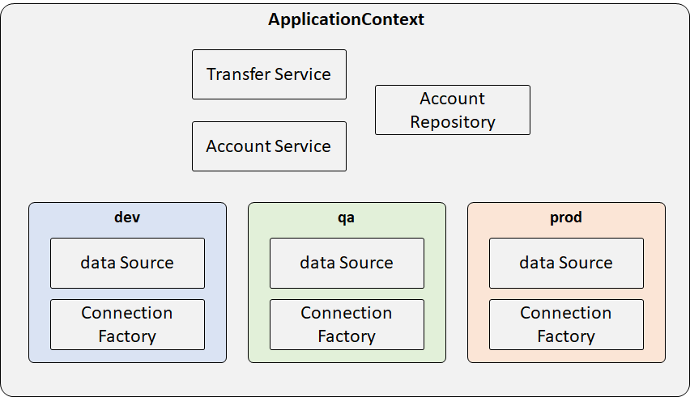
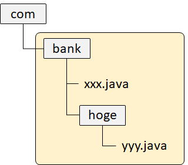

# Spring Conteiner, Dependency Injection
## Dependency Injectionとその利点
Dependency Injection (DI)は「依存性の注入」と訳される。  
必要なインスタンス（依存性）を**外から代入**することで、各モジュールが疎結合になるように設計する。  
硬い言葉で表現すると、あるオブジェクトに対して、利用（依存）しているオブジェクトを注入することで、オブジェクト間の依存関係を作成する。


DIを行うメリットとしては、
* クラス間・Layer間を疎結合化できる。
* Unitテストがしやすくなる（Testabilityの向上）
* インスタンスの差し替えなどが可能となる（例えば、テスト時に開発系・テスト系・本番系のデータアクセスクラスを用意してDIしたり）。

などが挙げられる。

### Spring FrameworkにおけるDIの方法
1. Javaコンフィグファイル
2. アノテーション
3. XML (→古いのでほとんど使われない)

::: danger 注意
XMLによる設定はすでにレガシーなので、原則的には使わないようにしましょう。
:::

### 参考
[初めてでも30分で分かるSpring 5 & Spring Boot 2オーバービュー](https://www.slideshare.net/masatoshitada7/30spring-5-spring-boot-2-103523666)

## パターン・アンチパターンとは。DIとはパターンなのか？
アンチパターンとは、推奨されない設計のことを指す。  
DIも設計パターンの一部と言える。

従来型のクラス設計（Servlet、ビジネスロジック、DAO、DTO）は、お互いが密結合になりがち。
結果として、改修を重ねるごとに改修の難易度が増す（ビジネスロジックの複雑化・肥大化が原因の1つ）。

DIを利用したクラス設計を行うことで、上記の各クラスが疎結合化し、関心事の分離が可能となる。
結果として、コードがスッキリする。

## インターフェイスとその利点
DIを行う上で、インターフェイスの用意は必須と言える。

（DIの利点ではないが）インターフェイスを用意することで、ポリモーフィズムの活用などでメリットが生まれる。

### 1. JDK Proxy
インターフェイスを実装したクラスにインジェクション（Spring FrameworkだとこちらがDefault。インターフェイス持たないクラスの場合、CGlib Proxyに処理を委譲する仕組みになっている）  
当たり前だが、インターフェイスを持たないクラスをProxy化することはできない。

### 2. CGlib Proxy
スーパークラスを継承したクラスにインジェクション（Spring BootだとこちらがDefault）  
スーパークラス側で`final`のついたクラス・メソッドは継承・オーバーライドができないため、それらのクラスはProxy化することができない。

## Spring beansでインターフェイスの利用が推奨される理由
Spring FrameworkではJDK Proxyがデフォルトとなっており、JDK ProxyによるProxy生成の前提条件として、インターフェースの実装があるため。

## application-contextとはSpringが管理するコンテナのこと
SpringのConfigurationクラスやApplicationクラスをインスタンス化する（これらインスタンスのことをBeanと呼ぶ）と、SpringのコンテナであるApplicationContext下で管理される。


Applicationクラスの例。
```java
public class TransferServiceImpl implements TransferService {
    // Needed to perform moneytransfers between accounts
    public TransferServiceImpl(AccountRepository ar) {
        this.accountRepository = ar;
    }
}

public class JdbcAccountRepository implements AccountRepository {
    // Needed to load accounts from the database
    public JdbcAccountRepository(DataSource ds) {
        this.dataSource = ds;
    }
}
```

Configurationクラス（Configuration Instructions）の例。
```java
@Configuration
public class ApplicationConfig{
    @Bean
    public TransferService transferService(){
        return new TransferServiceImpl(accountRepository());
    }

    @Bean
    public AccountRepository accountRepository(){
        return new JdbcAccountRepository(dataSource());
    }

    @Bean
    public DataSource dataSource(){
        BasicDataSource dataSource = New BasicDataSource();
        dataSource.setDriverClassName("org.postgresql.Driver");
        dataSource.setUrl("jdbc:postgresql://localhost/transfer");
        dataSource.setUsername("user");
        dataSource.setPassword("password");
        return dataSource;
    }
}
```

実行クラスの例。
```java
// Create the application from the configuration
ApplicationContext context = 
    SpringApplication.run( ApplicationConfig.class );

// Look up the application service interface
// "transferService"がBean IDとなる。
TransferService service = 
    context.getBean(“transferService”, TransferService.class);

// Use the application
service.transfer(new MonetaryAmount(“300.00”), “1”, “2”);
```

BeanへのアクセスはBean IDがユニークである場合に限り、以下のようにBean IDを省略できる（基本的に、Bean IDはユニークであるように設計するため、以下の書き方が一般的）。
```java
// No need for bean id if type is unique
TransferService ts3 = context.getBean(TransferService.class);
```

### JUnitのテストクラス作成（DIしない場合の例）
```java
public class TransferServiceTests {

    private TransferService service;

    @BeforeEach
    public void setUp() {
        // Create the application from the configuration
        ApplicationContext context =
            SpringApplication.run( ApplicationConfig.class );

        // Look up the application service interface
        service = context.getBean(TransferService.class);
    }

    @Test public void moneyTransfer() {
        Confirmation receipt =
            service.transfer(new MonetaryAmount("300.00"), "1", "2"));

        Assert.assertEquals("500.00", receipt.getNewBalance());
    }
}
```

## 複数ファイルからApplicationContextを作成する
`@Configuration`アノテーションを付けたクラスは長くなりがちなので、分割しておくことができる。

特定のConfigクラスを読み込むには、`@Import`アノテーションをつけて、読み込むクラス名を指定する。

大元のConfigクラス。`ApplicationConfig`クラスと`WebConfig`クラスをインポートしている。
```java
@Configuration
@Import({ApplicationConfig.class, WebConfig.class })
public class InfrastructureConfig {
    ...
}
```

インポートされるConfigクラスたち。
```java
@Configuration
public class ApplicationConfig {
    ...
}

@Configuration
public class WebConfig {
    ...
}
```

`Application` Beansと`Infrastructure` Beansを分離しておくのがBest Practices。


以下に２つに分割する前の例を示す。

```java
@Configuration
public class ApplicationConfig{
    @Bean
    public TransferService transferService(){
        return new TransferServiceImpl(accountRepository());
    }

    @Bean
    public AccountRepository accountRepository(){
        return new JdbcAccountRepository(dataSource());
    }
------------------------------------------------------------------
    @Bean
    public DataSource dataSource(){
        BasicDataSource dataSource = New BasicDataSource();
        dataSource.setDriverClassName("org.postgresql.Driver");
        dataSource.setUrl("jdbc:postgresql://localhost/transfer");
        dataSource.setUsername("user");
        dataSource.setPassword("password");
        return dataSource;
    }
}
```

以下に分割後の例を示す。  
`ApplicationConfig`クラス内のBeanは、インポート先の`TestInfrastructureConfig`クラスのDataSourceのBeanに依存している。

DataSourceのBeanを使うために、`@Autowired`アノテーションを使って、別のconfigクラスのBeanを取得する（これをインジェクションという）。コンストラクタでインジェクションするのが普通。

ただし、configクラス内でコンストラクタが１つの場合、`@Autowired`アノテーションを省略することができる。
```java{4,6}
@Configuration
public class ApplicationConfig {

    private final DataSource dataSource;

    @Autowired
    public ApplicationConfig(DataSource ds) {
        this.dataSource = ds;
    }

    @Bean 
    public TransferService transferService() {
        return new TransferServiceImpl ( accountRepository() );
    }

    @Bean 
    public AccountRepository accountRepository(DataSource dataSource) {
        return new JdbcAccountRepository( dataSource );
    }
}
```
```java{2}
@Configuration
@Import(ApplicationConfig.class)
public class TestInfrastructureConfig {
    @Bean 
    public DataSource dataSource() {
        ...
    }
}
```

## Beanのスコープ
### Singletonスコープ
デフォルトのスコープは`singleton`。
```java
@Bean
@Scope(“singleton”)
public AccountService accountService() {
    return ...
}
```
インスタンスが作られるのは１回きり。２回目は同じインスタンスが使い回される。
```java
AccountService service1 = (AccountService) context.getBean(“accountService”);
AccountService service2 = (AccountService) context.getBean(“accountService”);
assert service1 == service2; // True – same object
```
* Springアプリケーションは複数リクエストに対して、マルチスレッドで処理。
* スレッドセーフでなければならない（Stateless・Immutable beans）。

### Protptypeスコープ
```java
@Bean
@Scope(“prototype”)
public AccountService accountService() {
    return …
}
```
毎回新しいインスタンスが生成される。
```java
AccountService service1 = (AccountService) context.getBean(“accountService”);
AccountService service2 = (AccountService) context.getBean(“accountService”);
assert service1 != service2; // True – different objects
```

### Spring側で用意されているスコープ
| スコープ名 | 説明 |
| -- | -- |
| singleton | １つのインスタンスが作られる |
| prototype | 新しいインスタンスが毎回作られる |
| session | 新しいインスタンスがユーザごとに１つ作られる |
| request | 新しいインスタンスがリクエストごとに１つ作られる |

ほとんどの場合は、singleton。sessionを時々使う。他のスコープはまず使わない。

prototypeの場合、Springのコンテナ管理外となる。その場合、生成されたBeanはJavaのガベージコレクション（GA）の対象となり、普通のJavaのインスタンスとして扱われる。

## 環境設定（Environmentオブジェクトとして読み込み）の読み込み
以下の順番で、環境設定を読み込む（外から変えられるものから読み込まれる）。
1. Servlet Contextパラメータ（web.xml）
2. JNDI (Java Naming and Directory Interface)
3. JVMシステムプロパティ（java -Dxxx=yyy）
4. OS環境変数（Cloudでよく使う）
5. Javaプロパティファイル

### 環境変数の読み込み例
環境設定（app.properties）から取得した値を変数に格納して、引数として取る。
```java
@Configuration
public class DbConfig {
    
    Environment env;
    
    @Autowired
    public DbConfig(Environment env) {
        this.env = env;
    }

    @Bean
    public DataSource dataSource() {
        BasicDataSource ds = new BasicDataSource();
        ds.setDriverClassName( env.getProperty( "db.driver" ));
        ds.setUrl( env.getProperty( "db.url" ));
        ds.setUser( env.getProperty( "db.user" ));
        ds.setPassword( env.getProperty( "db.password" ));
        return ds;
    }
}
```

app.properties
```
db.driver=org.postgresql.Driver
db.url=jdbc:postgresql:localhost/transfer
db.user=transfer-app
db.password=secret45
```

Javaプロパティファイルを読み込むには、`@PropertySource`アノテーションを用いてファイルパスを指定する。
```java
@Configuration
@PropertySource ( "classpath:/com/organization/config/app.properties" )
@PropertySource ( "file:config/local.properties" )
public class ApplicationConfig {
    ...
}
```

## 環境変数（プロパティ）にアクセスする
`@Value`アノテーションを用いて、引数に値を代入することで、プロパティにアクセスすることもできる。Environmentオブジェクトをわざわざ用意する必要がなくなる。
```java
@Configuration
public class DbConfig {
    @Bean
    public DataSource dataSource(
            @Value("${db.driver}") String driver,
            @Value("${db.url}") String url,
            @Value("${db.user}") String user,
            @Value("${db.password}") String pwd) {
        BasicDataSource ds = new BasicDataSource();
        ds.setDriverClassName(driver);
        ds.setUrl(url);
        ds.setUser(user);
        ds.setPassword(pwd);
        return ds;
    }
}
```

## 開発系・テスト系・本番系で環境変数（プロパティ）を変更する
`${ENV}`を変数にして、複数のプロパティファイルに対応できる。
```java
@PropertySource ( "classpath:/com/acme/config/app-${ENV}.properties" )
```

開発系`app-dev.properties`
```
db.driver=org.postgresql.Driver
db.url=jdbc:postgresql://localhost/transfer
db.user=transfer-app
db.password=secret45
```

テスト系`app-qa.properties`
```
db.driver=org.postgresql.Driver
db.url=jdbc:postgresql://qa/transfer
db.user=transfer-app
db.password=secret88
```

本番系`app-prod.properties`
```
db.driver=org.postgresql.Driver
db.url=jdbc:postgresql://prod/transfer
db.user=transfer-app
db.password=secret99
```

## プロファイルを用いてBeanをグループ化
Beanをプロファイルでグループ化することができる。  
グループに属していないBeanは**いつでも**使われる。



`@Profile`でJava configクラスがどのグループに属するか決められる（メソッド単位で付けられる）。

```java{2}
@Configuration
@Profile("dev")
public class DevConfig {
@Bean
public DataSource dataSource() {
    EmbeddedDatabaseBuilder builder = new EmbeddedDatabaseBuilder();
    return builder.setName("testdb")
        .setType(EmbeddedDatabaseType.HSQL)
        .addScript("classpath:/testdb/schema.db")
        .addScript("classpath:/testdb/test-data.db").build();
}
```

開発用と本番用で同じBean ID名・異なるメソッド名を付けて、`@Profile`アノテーションで開発用と本番用を使い分ける。
```java{5,13}
@Configuration
public class DataSourceConfig {
    // 開発用
    @Bean(name="dataSource")
    @Profile("dev")
    public DataSource dataSourceForDev() {
        EmbeddedDatabaseBuilder builder = new EmbeddedDatabaseBuilder();
        return builder.setName("testdb") ...
    }

    // 本番用
    @Bean(name="dataSource")
    @Profile("prod")
    public DataSource dataSourceForProd() {
        BasicDataSource dataSource = new BasicDataSource();
        ...
        return dataSource;
    }
```

### 特定のプロファイル（グループ）から除外する
`!`を付けてプロファイルを指定することで、そのプロファイルから除外することができる。以下の例では、`dev`以外でBeanが使われる。
```java{2}
@Configuration
@Profile("!dev")
public class DevConfig {
    …
}
```

## プロファイルを有効化する方法
### JVMシステムプロパティ
```
-Dspring.profiles.active=dev,jpa
```

### Java config
```java
System.setProperty("spring.profiles.active", "dev,jpa");
SpringApplication.run(AppConfig.class);
```

### テスト時
`@ActiveProfiles`アノテーションを使う。

## プロパティファイルの選択（開発系・本番系）
### 開発系
開発用のプロパティファイル`dev.properties`を読み込む。  
プロファイルは`dev`を使う。
```java{2}
@Configuration
@Profile(“dev”)
@PropertySource ( “dev.properties” )
class DevConfig { … }
```

### 本番系
開発用のプロパティファイル`prod.properties`を読み込む。  
プロファイルは`prod`を使う。
```java{2}
@Configuration
@Profile(“prod”)
@PropertySource ( “prod.properties” )
class ProdConfig { … }
```

## Spring Expression Language(SpEL)
後回し(p.95)。

## アノテーションによるBean設定方法
これまでの説明では、`@Bean`アノテーションによりインジェクションするBeanをJavaコンフィグファイルにいちいち記述していた。

実は、Beanにするクラスに`@Component`アノテーションを付け、Javaコンフィグクラスに`@ComponentScan`アノテーションをつけることによって`@Bean`を付ける必要がなくなる。

このときのBean IDは、メソッド名になる（明示しない場合は）。

```java
@Component
public class TransferServiceImpl implements TransferService {
    @Autowired
    public TransferServiceImpl(AccountRepository repo) {
    this.accountRepository = repo;
    }
}
```

`com.bank`パッケージ以下にあるクラス（コンポーネント）をスキャンし、Beanを作る。
```java
@Configuration
@ComponentScan("com.bank")
public class AnnotationConfig {
    // No bean definition needed any more
}
```



### Bean IDの定義
1. Bean IDを明示的に記述
2. メソッドの頭文字を小文字にしたBean IDになる

2がほとんど。

## インジェクション（@Autowired）ができる箇所
基本的に、コンストラクタでインジェクションする。
### 1.　コンストラクタインジェクション
循環参照するケースでは、コンストラクタではだめ（あまりない）。
```java
@Autowired
public TransferServiceImpl(AccountRepository a) {
    this.accountRepository = a;
}
```

#### @Value
```java
@Autowired
public TransferServiceImpl(@Value("${daily.limit}") int max) {
    this.maxTransfersPerDay = max;
}
```

### 2. メソッド(Setter)インジェクション
Immutableにできない。何度も値がセットされるリスクがある。
```java
@Autowired
public void setAccountRepository(AccountRepository a) {
    this.accountRepository = a;
}
```

#### @Value
```java
@Autowired
public void setDailyLimit(@Value("${daily.limit}") int max) {
    this.maxTransfersPerDay = max;
}
```

### 3. フィールドインジェクション
フィールド変数はプライベート変数であるため、単体テストがしにくい。
```java
@Autowired
private AccountRepository accountRepository;
```

#### @Value
```java
@Value("#{environment['daily.limit']}")
int maxTransfersPerDay;
```

#### 参考
[http://olivergierke.de/2013/11/why-field-injection-is-evil/](http://olivergierke.de/2013/11/why-field-injection-is-evil/)

## インジェクション対象が曖昧なケース
```java
@Component
public class TransferServiceImpl implements TransferService {
    @Autowired
    public TransferServiceImpl(AccountRepository accountRepository) { … }
}
```
以下のように、AccountRepositoryインターフェースを実装したクラスが２つある場合、どちらをインジェクションしたらいいか判断できないため、`NoSuchBeanDefinitionException`例外が発生する。
```java
@Component
public class JpaAccountRepository implements AccountRepository {..}
---------------------------------------------------------------------
@Component
public class JdbcAccountRepository implements AccountRepository {..}
```

### 解決策
`@Qualifier`アノテーションを使い、インジェクション対象のBean IDを明示する。
```java
@Component("transferService")
public class TransferServiceImpl implements TransferService {
    @Autowired
    public TransferServiceImpl( @Qualifier("jdbcAccountRepository")
                                AccountRepository accountRepository) { … }
}
```
```java
@Component("jdbcAccountRepository")     // Bean ID
public class JdbcAccountRepository implements AccountRepository {..}
---------------------------------------------------------------------
@Component("jpaAccountRepository")      // Bean ID
public class JpaAccountRepository implements AccountRepository {..}
```
基本的に、Bean IDはユニークになるように設計する（上記の例はしょうがないにしても）。

## Delayed Initialization
基本的に、ApplicationContext（Springのコンテナ）が作成されたタイミングで、Beanが生成される。

しかし、`@Lazy`アノテーションをつけると、最初に使われるタイミングでBeanが生成される（`ApplicationContext.getBean`メソッド実行時）。

Beanが生成されるタイミングでSMTPサーバが起動していない場合
```java
@Lazy @Component
public class MailService {
    public MailService(@Value("smtp:...") String url) {
        // connect to mail-server
    }
…
}
```

まず使うことはない…。`@Lazy`を使っても起動が早くなるわけではない。

## Javaコンフィグとアノテーションの比較
基本的には、可能な限りアノテーションを利用して、それ以外をJavaコンフィグで記述する。
### Javaコンフィグ
```java
@Configuration
public class TransferConfiguration
    @Bean(name="transferService")
    @Scope("prototype")
    @Profile("dev")
    @Lazy(false)
    public TransferService tsvc() {
        return new TransferServiceImpl(accountRepository());
    }
}
```

### アノテーション
```java
@Component("transferService")
@Scope("prototype")
@Profile("dev")
@Lazy(false)
public class TransferServiceImpl implements TransferService {
    @Autowired
    public TransferServiceImpl (AccountRepository accRep) { … }
}
```

### コンポーネントスキャン
コンポーネントスキャンの範囲が多いと、起動時間が長くなる。そのため、スキャン対象の範囲はできるだけ小さくすることが重要。
### 良くない例
```java
@ComponentScan ({"org", "com"})
-------------------------------
@ComponentScan ("com")
```

### 良い例
```java
@ComponentScan ("com.bank.app")
-------------------------------
@ComponentScan ({"com.bank.app.repository", "com.bank.app.service", "com.bank.app.controller"})
```

## DI後の初期化処理とBeanインスタンスを破棄する前の処理
`@PostConstruct`アノテーションはDI後の初期化処理（メソッド）につける。すべてのDIが終わった後に呼ばれる。コンストラクタはDIのみに使い、その他の初期化処理はこのアノテーションを付けて行う。

`@PreDestory`アノテーションは、Beanインスタンスが破棄される直前に呼ばれる。

引数なし・戻り値なしでないと使えない。
```java
public class JdbcAccountRepository {
    @PostConstruct
    void populateCache() { }
    
    @PreDestroy
    void flushCache() { }
}
```

### @PostContruct
Setterメソッドが呼ばれた後、実行される。
```java
public class JdbcAccountRepository {

    private DataSource dataSource;
    
    @Autowired
    public void setDataSource(DataSource dataSource){
        this.dataSource = dataSource;
    
    }
    @PostConstruct
    public void populateCache(){
        Connection conn = dataSource.getConnection(); 
    }
}
```

```
Constructer called -> Setter called(setDataSource) -> PostConstructメソッド called(populateCache)
```

### @PreDestroy
一般的には、アプリケーションが終了する際に呼ばれる（プロセスがKillされたかどうかは関係ない）。リソースの開放を行う。
```java
ConfigurableApplicationContext context = …;
// Triggers call of all @PreDestroy annotated methods
context.close();
```
`context.close()`が呼ばれる前の段階で、以下の`@PreDestory`アノテーションのついたメソッドが呼ばれる。
```java
public class JdbcAccountRepository {
    @PreDestroy
    public void flushCache() { … }
    ...
}
```

## ステレオタイプアノテーション
`@Component`アノテーションの子アノテーションとして、いくつか別のアノテーションがある。いずれもコンポーネントスキャンの対象となる。

```java
@Service
@Repository
@Controller
@RestController
@Configuration
```


## [WIP] 積み残し課題
* What is the concept of a “container” and what is its lifecycle?
* How are you going to create a new instance of an ApplicationContext?
* Can you describe the lifecycle of a Spring Bean in an ApplicationContext?
* How are you going to create an ApplicationContext in an integration test test?
* What is the preferred way to close an application context? Does Spring Boot do this for you?
* Dependency injection using annotations (@Component, @Autowired)?
* Component scanning, Stereotypes and Meta-Annotations?
* Are beans lazily or eagerly instantiated by default? How do you alter this behavior?
* What is a BeanFactoryPostProcessor and what is it used for? When is it invoked?
* Why would you define a static @Bean method?
* What is a ProperySourcesPlaceholderConfigurer used for?
* What is a BeanPostProcessor and how is it different to a BeanFactoryPostProcessor?
* What do they do? When are they called?
* What is an initialization method and how is it declared on a Spring bean?
* What is a destroy method, how is it declared and when is it called?
* Consider how you enable JSR-250 annotations like @PostConstruct and @PreDestroy? When/how will they get called?
* How else can you define an initialization or destruction method for a Spring bean?
* What does component-scanning do?
* What is the behavior of the annotation @Autowired with regards to field injection, constructor injection and method injection?
* What do you have to do, if you would like to inject something into a private field? Ho does this impact testing?
* How does the @Qualifier annotation complement the use of @Autowired?
* What is a proxy object and what are the two different types of proxies Spring can create?
* What are the limitations of these proxies (per type)?
* What is the power of a proxy object and where are the disadvantages?
* What are the advantages of Java Config? What are the limitations?
* What does the @Bean annotation do?
* What is the default bean id if you only use @Bean? How can you override this?
* Why are you not allowed to annotate a final class with @Configuration
* How do @Configuration annotated classes support singleton beans?
* Why can’t @Bean methods be final either?
* How do you configure profiles?, What are possible use cases where they might be useful?
* Can you use @Bean together with @Profile?
* Can you use @Component together with @Profile?
* How many profiles can you have?
* How do you inject scalar/literal values into Spring beans?
* What is @Value used for?
* What is Spring Expression Language (SpEL for short)?
* What is the Environment abstraction in Spring?
* Where can properties in the environment come from – there are many sources for properties – check the documentation if not sure. Spring Boot adds even more.
* What can you reference using SpEL?
* What is the difference between $ and # in @Value expressions?