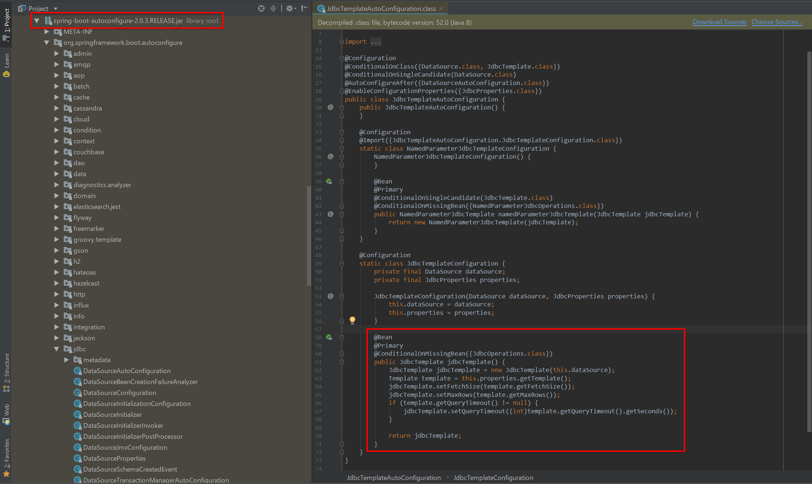

# Spring Boot
## Spring Bootとはなにか
Spring BootはJava Configのかたまり。  
Spring BootのAuto Configurationのjarファイル内で、素のSpring Frameworkで自分で定義していたJava Configが事前に用意されている。
特定のクラスがclasspathにあると自動的にBean定義してくれる。

## Spring Bootを使う利点
### 従来のSpring Frameworkでの開発
* 大量の設定（Java Configなど）を記述しなければならない。
* 結果として、なかなか実際のWeb開発に着手できない。

### Spring Bootを使った場合
Spring Bootでは、上記のSpring Frameworkの面倒くささを解消するために、予めおすすめの設定情報が記述されたJava Configクラスを用意してくれている。開発者は、設定情報を`application.properties`ファイルに記述していくだけでOK。

結果として、開発者が面倒な設定を（Java Configクラスとして）いちいち記述する必要がほとんどなくなり、すぐに実際の開発に着手できる。

## Spring Bootが独善的“opinionated”と言われる理由
素のSpring Frameworkで用意していた設定情報（Java Configやアノテーションなど）は、アプリケーション設計時にある程度決まりきった設定が使われる事が多い。

Spring Bootでは、その決まりきった設定を予めJava Configファイルとして設定しており、必要なものだけがアプリケーション実行時にBeanインスタンスとして呼び出される仕組みになっている（これがSpring Bootが**独善的**と表現される理由）。

## Spring Bootの内部で何が行われているのか
::: tip 重要
Spring Bootで設定をカスタマイズしたい場合、ソースコードの確認は重要です。
:::
例えば、Spring JDBCを例に見てみる。  
Spring Bootを入れると`spring-boot-autoconfigure`というJARファイルがインポートされる。このJARファイル内で用意されている`JdbcTemplateAutoConfiguration`クラスを見てみる。



クラスについているアノテーションを見てみると、`@ConditionalOnClass`アノテーションがついている。これは、`DataSource.class`と`JdbcTemplate.class`にclasspathが通っていると、このクラスがBeanインスタンス化されるという設定になっていることを意味している。

また、jdbcTemplateメソッドでは、各種設定情報がsetterで設定されている事がわかる。これは、Spring Bootでの設定ファイルである`application.properties`内で設定された値が、Getterメソッドで読み込まれ、Setterメソッドによって、実際のSpring Frameworkの設定として読み込まれる。

```java{2,22,23,24,25,26,28}
@Configuration
@ConditionalOnClass({DataSource.class, JdbcTemplate.class})
@ConditionalOnSingleCandidate(DataSource.class)
@AutoConfigureAfter({DataSourceAutoConfiguration.class})
@EnableConfigurationProperties({JdbcProperties.class})
public class JdbcTemplateAutoConfiguration {
    public JdbcTemplateAutoConfiguration() {
    }
    @Configuration
    static class JdbcTemplateConfiguration {
        private final DataSource dataSource;
        private final JdbcProperties properties;

        JdbcTemplateConfiguration(DataSource dataSource, JdbcProperties properties) {
            this.dataSource = dataSource;
            this.properties = properties;
        }

        @Bean
        @Primary
        @ConditionalOnMissingBean({JdbcOperations.class})
        public JdbcTemplate jdbcTemplate() {
            JdbcTemplate jdbcTemplate = new JdbcTemplate(this.dataSource);
            Template template = this.properties.getTemplate();
            jdbcTemplate.setFetchSize(template.getFetchSize());
            jdbcTemplate.setMaxRows(template.getMaxRows());
            if (template.getQueryTimeout() != null) {
                jdbcTemplate.setQueryTimeout((int)template.getQueryTimeout().getSeconds());
            }

            return jdbcTemplate;
        }
    }
}
```

以下に、Spring Bootのソースコード中に出現するアノテーションをまとめた。

| アノテーション | 説明 |
| ------------- | ------------- |
| @ConditionalOnClass | 指定したクラスがクラスパス上に存在すれば有効化 |
| @ConditionalOnBean | 指定したBeanがコンテナに存在すれば有効化 |
| @ConditionalOnMissingBean | 指定したBeanがコンテナに存在しなければ有効化 |
| @ConditionalOnProperty | 指定したプロパティがapplication.propertiesに設定されていれば有効化 |
| @ConditionalOnWebApplication | Webアプリケーションであれば有効化 |
| @AutoConfigureAfter/@AutoConfigureBefore | 指定したAutoConfigurationの前/後に読み込む |

## Spring Bootの落とし穴（Spring Bootの設定に影響を与えるもの）
上述したとおり、Spring Bootは事前にJava Configクラスを定義しており、必要に応じてそれらをBeanインスタンス化し、Springのコンテナ内で管理している。では、独自にBeanを定義したり、アノテーション（@EnableXxx系のアノテーション）による設定を行った場合どうなるか？

設定をミスると、Spring Bootが動かなくなる…。

### Spring Bootで避けたい事項
* フレームワークを動かすBeanは、なるべく自前で定義しないこと
* @EnableXxxはクラスになるべく付けないこと

上記の内容を起こった結果、（表向きは）理由のわからないエラーでSpring Bootが動かなくなりがち（初心者あるある）。  
ブログ記事でも、間違った記述が散見されるため、カスタマイズを行いたい場合は基本的に公式の資料やSpring BootのAutoConfigurationのソースコードを確認の上実行。

### Spring Bootの設定を変更したい場合
1. `application.properties`で設定  
だいたいこれで解決できるはず。  
```
spring.datasource.url=jdbc:mysql://localhost/test
spring.datasource.username=dbuser
spring.datasource.password=dbpass
spring.datasource.driver-class-name=com.mysql.jdbc.Driver
spring.datasource.schema=/testdb/schema.sql
spring.datasource.data=/testdb/data.sql

logging.level.root=INFO
server.port=8081
spring.jpa.show-sql=true
```

どういった内容を設定できるかは、Spring Bootの公式リファレンスを参照のこと。  
[Spring Boot Reference Guide - Appendix A. Common application properties](https://docs.spring.io/spring-boot/docs/current/reference/htmlsingle/#common-application-properties)

2. Spring Boot側で設定されているBeanをDIで取得して、Setterで設定を登録  
```java
@Configuration
public class JdbcTemplateCustomConfiguration {
    private final JdbcTemplateConfiguration jdbcConfig;

    @Autowired
    public JdbcTemplateCustomConfiguration(JdbcTemplateConfiguration jdbcConfig) {
        this.jdbcConfig = jdbcConfig;
    }

    @PostConstruct    // Beanインスタンス化の後に実行
    public void init() {
        jdbcConfig.setXxx(...);    // 設定したい内容を指定
    }
}
```

3. 補助的なBeanを定義してSpringのコンテナに登録  
ThymeleafにDialectを追加する例。
```java
@Configuration
public class MyThymeleafConfiguration {
    @Bean
    public FooDialect fooDialect() {
        return new FooDialect();
    }

    @Bean
    public BarDialect barDialect() {
        return new barDIalect();
    }
}
```

上記の内容は以下の資料を参考にした。  
[Spring Bootの本当の理解ポイント](https://www.slideshare.net/masatoshitada7/spring-boot-jjug) 

## Spring Bootにおける設定情報の書き方
`application.properties`もしくは`application.yml`に記述する。  

どういった内容を設定できるかは、Spring Bootの公式リファレンスを参照のこと。  
[Spring Boot Reference Guide - Appendix A. Common application properties](https://docs.spring.io/spring-boot/docs/current/reference/htmlsingle/#common-application-properties)

以下に例を示す。

### 1. application.properties
ただのTextファイルなので、１行ずつ設定情報を記載する形となる。
```
database.host = localhost
database.user = admin
```

### 2. application.yml
YAMLファイルとして記述できるので、情報を階層化して表現することができる。
```yaml
database:
  host: localhost
  user: admin
```

開発用と本番用に設定を分けることもできる。
```yaml
logging.level:
org.springframework: INFO
---
spring.profiles: development
database:
host: localhost
user: dev
---
spring.profiles: production
database:
host: 198.18.200.9
user: admin
```

## Tomcat組み込みJARと従来のWAR
Spring Bootでは、Tomcat組み込みJARと従来のWARの両方をサポートしている（両者に性能面で違いはない）。

### 1. Tomcat組み込みJAR
Spring Bootでは、標準ではTomcatを内部に組み込んだJARファイル（ファイルサイズが大きいのでFat JARと呼ばれる）をビルド成果物として生成する。
一方で、jar.originalには自分のソースコードしか入っていない、従来のJARファイルになる。
```
22M yourapp-0.0.1-SNAPSHOT.jar
5K  yourapp-0.0.1-SNAPSHOT.jar.original
```

クラウド環境では、組み込みサーバが推奨となっている。  
クラウド向けアプリの指針である12-Factor applications #7で謳われている。  
[12-Factor applications](https://12factor.net/)

### 2. 従来のWAR
一方で、Tomcatを同梱していない従来型のWARファイルも出力させることができる。  
WARファイルを出力したい場合は、以下の設定を行う。
```java
@SpringBootApplication
public class Application extends SpringBootServletInitializer {
    protected SpringApplicationBuilder configure(SpringApplicationBuilder application) {
        return application.sources(Application.class);
    }
}
```

JARとWARファイルを両方出力したい場合は、以下の設定を行う。
```java
@SpringBootApplication
public class Application extends SpringBootServletInitializer {
    protected SpringApplicationBuilder configure(SpringApplicationBuilder application) {
        return application.sources(Application.class);
    }

    public static void main(String[] args) {
        SpringApplication.run(Application.class, args);
    }
}
```

あと、`pom.xml`で`spring-boot-starter-tomcat`でscopeを`provided`を設定する。
```xml
<dependency>
    <groupId>org.springframework.boot</groupId>
    <artifactId>spring-boot-starter-tomcat</artifactId>
    <scope>provided</scope>
</dependency>
```

## Spring Bootがサポートしている組み込みサーバ
デフォルトは、Tomcatサーバ。その他にも以下のサーバに対応。
1. Tomcat
2. Jetty
3. Undertow

`pom.xml`での設定方法は以下の通り。  
以下では、Tomcatサーバを除外して、Jettyサーバを組み込んでいます。
```xml
<dependency>
    <groupId>org.springframework.boot</groupId>
    <artifactId>spring-boot-starter-web</artifactId>
    <exclusions>
        <exclusion>
            <groupId>org.springframework.boot</groupId>
            <artifactId>spring-boot-starter-tomcat</artifactId>
        </exclusion>
    </exclusions>
</dependency>

<dependency>
    <groupId>org.springframework.boot</groupId>
    <artifactId>spring-boot-starter-jetty</artifactId>
</dependency>
```

## @SpringBootApplicationの意味
`@SpringBootApplication`は、以下の３つのアノテーションと同義。
```java
@Configuration
@ComponentScan
@EnableAutoConfiguration
```

つまり、@SpringBootApplicationを指定することで、自身のクラスの配置されているパッケージをルートとしてコンポーネントスキャンを実行し、Java Configを読み込んでいる。

また、AutoConfiguration機能により、classpathの通っているものを対象としたJava Configを有効化し、Beanインスタンスを生成している。

## Spring BootにおけるComponent Scanning
例えば、`transfers`パッケージ以下をコンポーネントスキャンしたい場合、以下のように設定する。
```java
@SpringBootApplication(scanBasePackages="transfers")
```

もしくは、
```java
@SpringBootConfiguration
@EnableAutoConfiguration
@ComponentScan("transfers")
```

## Spring Boot starter POMとは
Spring Bootにおける`pom.xml`の設定について説明する。  
ベースとなるSpring Bootに必要なライブラリは、parentタグで`spring-boot-starter-parent`と使用するバージョンを指定する。

このstarterでは依存関係にある多くのライブラリを読み込む。  
dependenciesタグ内で、その他に必要なライブラリを指定し、読み込む。このとき、parentタグ側でバージョンが指定されているため、そのバージョンに合わせたライブラリを読み込んでくれる（こちら側で指定する必要なし）。

いかに具体的な例を示す（Mavenの場合）。
```xml
<parent>
    <groupId>org.springframework.boot</groupId>
    <artifactId>spring-boot-starter-parent</artifactId>
    <version>2.0.3.RELEASE</version>
    <relativePath/> <!-- lookup parent from repository -->
</parent>

<dependencies>
    <dependency>
        <groupId>org.springframework.boot</groupId>
        <artifactId>spring-boot-starter-web</artifactId>
    </dependency>

    <dependency>
        <groupId>org.springframework.boot</groupId>
        <artifactId>spring-boot-devtools</artifactId>
        <scope>runtime</scope>
    </dependency>
    <dependency>
        <groupId>org.springframework.boot</groupId>
        <artifactId>spring-boot-starter-test</artifactId>
        <scope>test</scope>
    </dependency>

    <dependency>
        <groupId>org.springframework.boot</groupId>
        <artifactId>spring-boot-starter-data-jpa</artifactId>
    </dependency>

    <dependency>
        <groupId>com.h2database</groupId>
        <artifactId>h2</artifactId>
        <scope>runtime</scope>
    </dependency>
</dependencies>
```

## Spring Bootにおけるロギング

## Spring Bootにおけるテスト
JUnitテストクラスにおいて、`@SpringBootTest(classes=XxxAplication.class)`アノテーションをつける。

いかに例を示す。
```java
@ExtendWith(SpringExtension.class)
@SpringBootTest(classes=Application.class)
public class TransferServiceTests {
    @Autowired
    private TransferService transferService;
    
    @Test
    public void successfulTransfer() {
        TransferConfirmation conf = transferService. transfer(...);
        // 処理を書く
    }
}
```

## 参照
[Spring Bootの本当の理解ポイント](https://www.slideshare.net/masatoshitada7/spring-boot-jjug)  
