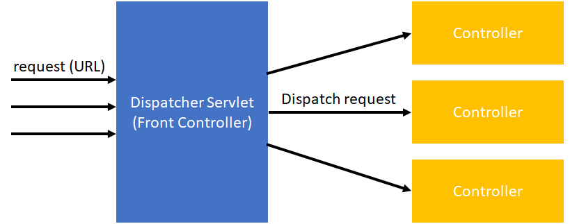
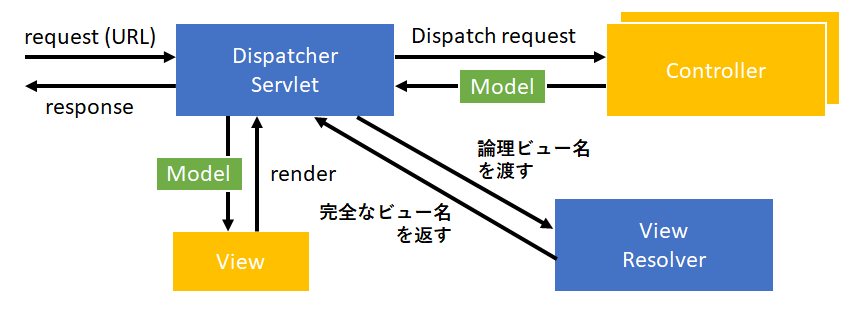
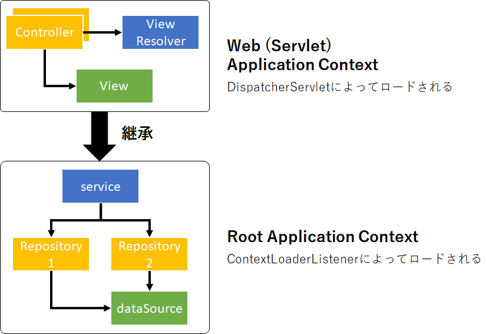

# Spring MVC and the Web Layer
## Spring MVCについて
* MVCとは、`Model/View/Controller`の略。
* Spring MVCは、Controllerの部分のみを提供している。
* Front controllerパターンを採用している。

### Spring MVCの特徴
* POJOプログラミング
* Testしやすい（Testable）
* 設定にはJava Configを利用

### View部分の実装
サーバーサイドレンダリング（Viewの部分）として以下のものをサポートしている（他にもある）。
* Thymeleaf
* FreeMarker
* JSP
* PDF
* Excel

## DispatcherServletとは
SpringにおけるDispatcher Servletとは、すべてのRequestを受け取り、Controllerに処理を振り分ける役割をしている（Front Controllerとも呼ばれる）。  



Dispatcher Servletクラスは、受け取ったRequestをもとに各Controller（ビジネスロジック）に処理を割り振り、Modelを受け取る。
受け取ったModelをもとに、View（JSPやThymeLeafなど）をサーバーサイドでレンダリングし、Responseとして返す。

このように、SpringではWeb Layerをできるだけ薄くし、関心事（ビジネスロジックとViewのレンダリング）の分離を行っている。



## web application contextとDispatcherServlet
WebApplicationContextはApplicationContextを継承したクラスであり、

* Requestスコープ
* Sessionスコープ

がサポートされている。

DispatcherServletによってWebApplicationContext（ViewResolver、View、Controllerインスタンスを含む）が呼び出される。



Spring Bootでは設定済みのDispacherServletが使われるので、開発者側で独自に用意する必要はない。

### 参考
[Spring Web MVC - 1.2.1. Context Hierarchy](https://docs.spring.io/spring/docs/5.0.7.RELEASE/spring-framework-reference/web.html#mvc-servlet-context-hierarchy)  
[org.springframework.web.servlet - Class DispatcherServlet](https://docs.spring.io/spring/docs/current/javadoc-api/org/springframework/web/servlet/DispatcherServlet.html#DispatcherServlet-org.springframework.web.context.WebApplicationContext-)  
[What is the difference between ApplicationContext and WebApplicationContext in Spring MVC?](https://stackoverflow.com/questions/11708967/what-is-the-difference-between-applicationcontext-and-webapplicationcontext-in-s)


## Controllerクラスの定義
### @Controllerと@GetMapping(@RequestMappingの仲間)
Controllerクラスに、`@Controller`アノテーションをつける。  
特定のURLでHTTP GET Requestが送られてきたときに、処理を受け渡すメソッドに対して`@GetMapping`アノテーションをつける（URLと処理（メソッド）の紐づけ）。

このとき、完全なパスが`http://localhost:8080/listAccounts`だったとすると、論理パスである`/listAccounts`を`@GetMapping`で定義する。

Dispatcher Servletが受け取ったRequestを論理パスをもとに、処理を特定のメソッドに振り分けてくれる。
```java
@Controller
public class AccountController {
    @GetMapping("/listAccounts")
    public String list(Model model) {...}
}
```

論理パスには、ワイルドカードをつけてURLを指定することもできる。  
以下にURLの例をいくつか示す。
```
– /accounts
– /accounts/edit
– /editAccount
– /accounts/*
```

デフォルトでは、`.html`のようなSuffixは無視される。
```
– /listAccounts.html
```

## @RequestMappingとは
@RequestMappingを使ってURLと処理（メソッド）の紐づけをする場合、GET、POST、PUT、DELETEのいずれかを指定する必要があった。

Spring v4.3以降では、GET、POST、PUT、DELETEの役割を持つ`@RequestMapping`の代替となるアノテーションが追加された。
```
– @GetMapping
– @PostMapping
– @PutMapping
– @DeleteMapping
```

::: tip 推奨
基本的に上記の４つを使ってURLと処理（メソッド）の紐づけをControllerクラス内で行う。
:::

## Requestパラメータの取得
### @RequestParam
`@RequestParam`アノテーションでRequestパラメータを引数として取得する。
以下の例は、`http://localhost:8080/showAccount.htm?entityId=123`をRequestとして受け取った例。引数のidには`123`が格納される。
```java
@Controller
public class AccountController {
    @GetMapping("/showAccount")
    public String show(@RequestParam("entityId") long id, Model model) {
        … // 何らかの処理
    }
}
```

## URLの一部を引数に取る
### @PathVariable
`@PathVariable`アノテーションでURLの一部を引数に取ることができる。  
以下の例は、`http://localhost:8080/accounts/123`をRequestとして受け取った例。引数のidには`123`が格納される。
```java
@Controller
public class AccountController {
    @GetMapping("/accounts/{accountId}")
    public String show(@PathVariable("accountId") long id, Model model) {
        … // 何らかの処理
    }
}
```

### もっとシンプルに書く
URLの`{accountId}`と引数の`accountId`の名称を一致させることで、以下のようにも記述できる。こちらのほうがシンプル。
```java
@GetMapping("/accounts/{accountId}")
public String show(@PathVariable long accountId, Model model)
```

注意点として、コンパイル時に、
```
javac -parameters
```
と`-parameters`を付ける必要がある(JDK 8+が条件)。  
Javaはデフォルト設定でコンパイルすると、引数が`var1`、`var2`のような適当な変数名に置換されてしまうため、上記で説明した方法がうまく動かない。

ちなみに、Spring Bootではデフォルトで上記の設定になっているので、気にする必要がない。

## @RequestParamと@PathVariableの違い
パラメータとして値を渡すか、URLの一部に値を組み込んで渡すかの違い。  
リクエストパラメータに特定の値をもたせるよりも、パスに特定の値をもたせたほうがシンプル。

## @RequestParamと@PathVariableの事例
### http://localhost:8080/accounts
```java
@GetMapping("/accounts")
public String show(HttpServletRequest request, Model model)
```

### http://.../orders/1234/items/2
```java
@GetMapping("/orders/{id}/items/{itemId}")
public String show(@PathVariable(“id”) Long orderId,
                   @PathVariable int itemId,
                   Model model, Locale locale,
                   @RequestHeader(“user-agent”) String agent )
```

### http://.../orders?orderId=1234&item=2
```java
@GetMapping("/orders")
public String show(@RequestParam Long orderId,
                   @RequestParam(“item”) int itemId,
                   Principal user, Map<String,Object> model,
                   HttpSession session )
```

## Viewとしてサポートしているもの
Viewとは、Webブラウザに出力するHTMLをレンダリングする部分。

Spring MVCがサポートするViewは以下の通り。
* Thymeleaf
* FreeMarker
* JSP
* PDF
* Excel

などなど。  
基本的に、Spring MVCは上記のViewをサーバサイドレンダリングしている。
::: tip 推奨
Thymeleafが75%シェアでおすすめ。次に、FreeMarkerがよく使われている。
:::
::: warning 警告
JSPはクロスサイトスクリプティングの脆弱性を持つので、新規の開発では用いない。
:::

## ViewResolver
View Resolverインターフェースは、テンプレートエンジンに合わせて用意されている。
論理パスを完全なパスに置換して、DispatcherServletに返す役割を担う。

以下に、Mustacheを使った例を示す。  
このようにPrefixとSuffixを設定しておく。
```java
@Bean
public ViewResolver resolver(Compiler mustacheRuntime) {
    MustacheViewResolver mvr = new MustacheViewResolver();
    mvr.setPrefix ( "classpath:/templates/" );
    mvr.setSuffix ( ".html" );
    return mvr;
}
```

@xxxMapingアノテーションで指定した論理パスを、ViewResolverが以下のような完全なパスに置換する。
```
Prefix + @xxxMappingアノテーションの値 + Suffix
```

### Spring Bootの場合
Spring Bootの場合、以下の例のように`application.properties`に定義しておく。
```
spring.mustache.prefix=classpath:/templates/
spring.mustache.suffix=.html
```

## Spring BootでSpring MVCを使う場合
### 1. pom.xmlの定義
```xml
<dependency>
    <groupId>org.springframework.boot</groupId>
    <artifactId>spring-boot-starter-web</artifactId>
</dependency>
```

デフォルトでTomcatサーバが組み込まれているが、他のものに変更したい場合は以下のように設定する（Jettyに変える場合）。
```xml
<dependency>
    <groupId>org.springframework.boot</groupId>
    <artifactId>spring-boot-starter-web</artifactId>
    <exclusions>
        <exclusion>
            <groupId>org.springframework.boot</groupId>
            <artifactId>spring-boot-starter-tomcat</artifactId>
        </exclusion>
    </exclusions>
</dependency>

<dependency>
    <groupId>org.springframework.boot</groupId>
    <artifactId>spring-boot-starter-jetty</artifactId>
</dependency>
```

fat JARをビルドするのに、以下の設定も必要。
```xml
<build>
    <plugins>
        <plugin>
            <groupId>org.springframework.boot</groupId>
            <artifactId>spring-boot-maven-plugin</artifactId>
        </plugin>
    </plugins>
</build>
```

### 2. Controllerクラスの設計
```java
@Controller
public class RewardController {
    
    private RewardLookupService lookupService;
    
    // ビジネスロジッククラスのインジェクション
    @Autowired
    public RewardController(RewardLookupService svc) {
        this.lookupService = svc;
    }
    
    // 論理パスに対応する処理（メソッド）
    @GetMapping("/rewards/{id}")
    public String show(@PathVariable("id") long id, Model model) {
        Reward reward = lookupService.lookupReward(id);
        model.addAttribute(“reward”, reward);
        return “rewardView”;
    }
}
```

### 3. ViewResolverの設定
以下のように、ViewResolverを設定しておく。  
以下、Spring Bootのドキュメントから抜粋。
```
# THYMELEAF (ThymeleafAutoConfiguration)
spring.thymeleaf.prefix=classpath:/templates/ # Prefix that gets prepended to view names when building a URL.
spring.thymeleaf.suffix=.html                 # Suffix that gets appended to view names when building a URL.
```

### 4. テンプレートViewの用意
テンプレートエンジンによるので割愛。

## @EnableWebMvc
Spring Bootを使っていない場合、このアノテーションを付けてSpring MVCの設定を行う。

::: tip
@EnableXxxはSpringの特定の機能を有効化するものであり、Spring BootではAutoConfiguration用のクラスですべて定義済みである。  
そのため、不用意に上記のアノテーションを付けてしまうと、Spring Bootが動かなくなる一因となる。
:::

## 静的ファイルの扱い（画像データ、CSSファイルなどなど）
テンプレートViewだと、`/src/main/resources/resources/templates`直下など使えるパスが決まっている。


## [WIP] 積み残し課題(重要度低)
* What are some of the parameter types for a controller method?
* What other annotations might you use on a controller method parameter? (You can ignore form-handling annotations for this exam)
* What are some of the valid return types of a controller method?
* How is the right View chosen when it comes to the rendering phase?
* Why do you have access to the model in your View? Where does it come from?
* What is the purpose of the session scope?
* What is the default scope in the web context?
* Why are controllers testable artifacts?