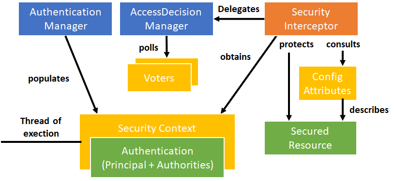
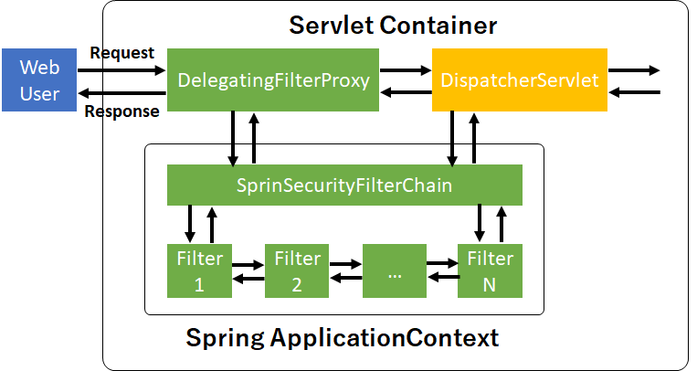
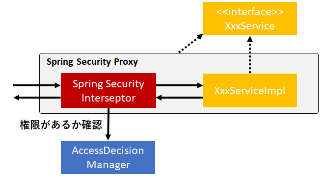

# Security
## セキュリティ用語
* Principal: システムを扱う人・機械のこと
* Authentication(認証): ID・パスワードが有効かどうか確認すること（ログイン）
* Authorization(認可): アクセス権のこと。
* Authority(権限): 管理者権限・ユーザ権限とか。（Roleともいう）
* Secured Item: セキュリティで保護されている対象。

## 認証と認可
認証が先で、認可が後から付与されるもの。
### 認証
* BASIC認証
* OAuth認証

などなど。

認証情報を保存しておくストレージの種類。
* in-memory
* Database
* LDAP

### 認可
認可は認証に依存している。  
ユーザが必要な権限を持っているかどうか決めること、それが認可。

認可は`Role`（`ADMIN`, `USER`, `GUEST`とか）と呼ばれることが多いので覚えておくこと。

## Spring Securityに期待すること
### Portable
* サーバのセキュリティ設定をアプリケーション内で完結してほしい。  

サーバ上で設定すると、環境が変わる（サーバ更新）ごとに変更を加えないといけない。

Spring Bootなら、Tomcatサーバが組み込まれているのでアプリケーション内でセキュリティの設定を完結できる。

### Separation of Concerns
* セキュリティの設定（付加的な処理）をビジネスロジックと分離したい。
* 認証と認可も分離したい。

認証はよく変わる（ユーザが追加・削除する、パスワードを変更など）。すると、認証と紐付いている認可の設定も同時に変更する必要が出てくる。

関心事の分離といえば、AOP。SpringではAOPでセキュリティの設定をビジネスロジックに組み込んでいる（セキュリティは横断的関心事の１つ）。

### Flexibility
* いろんな認証方法をサポートしてほしい（BASIC, Cookies, Single-Sign-Onなど）。
* いろんな認証情報を保存する手段もサポートしてほしい（RDBMS, LDAPなど）。

### Extensible
* セキュリティの設定をカスタマイズしやすくしてほしい。

## Spring Securityの外観



### Config Attribute
特定のユーザしかアクセスできないようにする。

### Security Interceptor
リソースを保護している。アクセス可能かどうかAccessDicisionManagerに確認する。

認可が降りない場合は、Exceptionをはく。

## RequestからDispatcherServletへ処理を渡すまで


### フィルタプロキシ（Filter proxy）
Servletコンテナ内で管理されている`DelegatingFilterProxy`は自分と同じ名前のBeanIDを持つインスタンスへ処理を移譲するだけの存在。

### Security filter chain
`DelegatingFilterProxy`から処理を受けるのが`SpringSecurityFilterChain`。SpringApplicationContext内で管理されている。

`SpringSecurityFilterChain`を起点にして、複数のFilterに通していく（SpringのDIコンテナ内）。Responseを返す場合、Requestと逆の流れを行く。

こちらはSpring側での設定になるが、Spring Bootを使用する場合は設定不要。

## @EnableWebSecurity
* Spring Securityの有効化に必要。Spring Bootでも必要なので注意。
* @Configurationアノテーションは必要ない（すでにinterfaceで定義されている）。

```java
@Configuration
@EnableWebSecurity
public class SecurityConfig extends WebSecurityConfigurerAdapter {
    @Override
    protected void configure(HttpSecurity http) throws Exception {
    }

    @Autowired
    public void configureGlobal(AuthenticationManagerBuilder auth) throws Exception {
    }
}
```

## 特定のユーザに対して認可を行う
特定のURLに対して、認可（アクセス権）を定義する。  
以下の例では、`/admin`以下のファイルに対して`ADMIN`権限（Role）を持つユーザがアクセスできる。
```java
protected void configure(HttpSecurity http) throws Exception {
    http.authorizeRequests().antMatchers("/admin/**").hasRole("ADMIN")
    …
}
```

`antMatchers`のURLパターンで使えるワイルドカードの意味は以下の通り。

| URLパターン | 説明 |
| -- | -- |
| /admin/* | /admin/xxxのみ |
| /admin/** | /admin, /admin/xxx, /admin/xxx/yyy など |

### antMatchersとmvcMatchersについて
* mvcMatchersのほうが新しいAPIで、よりセキュア。
* mvcMatchersのマッチングルールは、`@RequestMapping`アノテーションと同じ（Suffixは任意でOK）。
```java
http.authorizeRequests()
// Only matches /admin
.antMatchers("/admin").hasRole("ADMIN")
// Matches /admin, /admin/, /admin.html, /admin.xxx
.mvcMatchers("/admin").hasRole("ADMIN")
```

### 複数の設定をする場合
メソッドチェーンでつなげて設定する。  
```java
protected void configure(HttpSecurity http) throws Exception {
    http
      .authorizeRequests()
        .mvcMatchers("/signup", "/about").permitAll()
        .mvcMatchers("/accounts/edit*").hasRole("ADMIN")
        .mvcMatchers("/accounts/**").hasAnyRole("USER", "ADMIN")
        .anyRequest().authenticated();
}
```

以下にRoleの指定の仕方についてまとめた。

| Roleパターン | 説明 |
| -- | -- |
| permitAll | すべてのユーザを認可 |
| hasRole | １つのRoleを認可 |
| hasAnyRole | 複数のRoleを認可 |

`.anyRequest().authenticated()`を最後につける。全てのURLリクエストは認証されているユーザーしかアクセスできないという意味。

これを設定しておくことで、セキュリティの設定漏れによってアクセスできてしまうファイルがないようにする。

## ログイン・ログアウトのセキュリティ設定
```java
protected void configure(HttpSecurity http) throws Exception {
    http
        .authorizeRequests()
        .mvcMatchers("/admin/**").hasRole("ADMIN")...
        .and() // method chaining!

        // ログイン設定
        .formLogin() // setup form-based authentication
        .loginPage("/login") // URL to use when login is needed
        .permitAll() // any user can access
        .and() // method chaining!

        // ログアウト設定
        .logout() // configure logout
        .logoutSuccessUrl("/home") // go here after successful logout
        .permitAll(); // any user can access
}
```
上記の`mvcMatchers`に一致する`/login`をFORMタグのaction属性に指定したHTMLファイル。
```html
<form action=“/login” method=“POST”>
    <input type=“text” name=“username”/>
    <br/>
    <input type=“password” name=“password”/>
    <br/>
    <input type=“submit” name=“submit” value=“LOGIN”/>
</form>
```

### ログイン設定
ログインページとRoleの設定を行う。

### ログアウト設定
ログアウト後に遷移するページとRoleの設定を行う。

`and()`で設定同士をメソッドチェーンでつなげることができる。

## セキュリティ対象外に設定する
CSSファイルやJavascriptファイル、Imageファイルなどどのユーザでもアクセスできるファイルは、以下の例のようにセキュリティ対象外に設定する。

```java
protected void configure(WebSecurity web) throws Exception {
    web.ignoring().mvcMatchers("/css/**", "/images/**", "/javascript/**");
}
```

`ignoring()`を使って、マッチングするフォルダ内に存在するファイルをセキュリティ対象外に設定することができる。

## In-Memoryでのユーザ情報設定（テスト用）
```java
@Autowired
public void configureGlobal(AuthenticationManagerBuilder auth) throws Exception {
    auth
        .inMemoryAuthentication()
        .withUser("hughie").password("hughie").roles("GENERAL").and()
        .withUser("dewey").password("dewey").roles("ADMIN").and()
        .withUser("louie").password("louie").roles("SUPPORT");
}
```

## DBからのユーザ情報取得
DataSourceのインスタンスをコンストラクタでインジェクション。
```java
private DataSource dataSource;

@Autowired
public void setDataSource(DataSource dataSource) throws Exception {
    this.dataSource = dataSource;
}

@Autowired
public void configureGlobal(AuthenticationManagerBuilder auth) throws Exception {
    auth.jdbcAuthentication().dataSource(dataSource);
}
```

## パスワードのハッシュ化
Spring Securityではパスワードのハッシュ化をサポートしている。
* sha256, bcryptなど（sha256は脆弱性があることがわかっているので、bcrypt推奨）

以下に、bcryptでハッシュ化する例を示した。
```java
auth.inMemoryAuthentication()
    .passwordEncoder(new BCryptPasswordEncoder(12));
```

引数の`12`は、2の12乗ハッシュ化の処理を繰り返すという意味。  
数字を大きくすれば、よりセキュアになるがパフォーマンスに影響するので注意。

ハッシュ化したパスワードをDBなどに保存する。  
以下では、In-Memoryでパスワードを保存したときの例を示す。

```java
auth.inMemoryAuthentication()
    .withUser("hughie")
    .password("$2a$10$aMxNkanIJ...Ha.h5NKknelEuylt87PNlicYpI1y.IG0C.")
    .roles("GENERAL")
```

## @Profileを使って開発用と本番用でセキュリティ設定を変更する
`@Profile`アノテーションを用いて、開発用・テスト系・本番系などでログイン情報の参照先を変えることができる。

以下に設定を示す。
```java
public class SecurityBaseConfig extends WebSecurityConfigurerAdapter {

    protected void configure(HttpSecurity http) throws Exception {
        http.authorizeRequests().mvcMatchers("/resources/**").permitAll();
    }
}
```
開発系用。
```java{3}
@Configuration
@EnableWebSecurity
@Profile("development")
public class SecurityDevConfig extends SecurityBaseConfig {

    @Autowired
    public void configureGlobal(AuthenticationManagerBuilder auth) throws Exception {
        auth.inMemoryAuthentication()
            .withUser("hughie").password("hughie").roles("GENERAL");
    }
}
```
テスト系・本番系用。
```java{3}
@Configuration
@EnableWebSecurity
@Profile("jdbc")
public class SecurityJdbcConfig extends SecurityBaseConfig {

    @Autowired
    public void configureGlobal(AuthenticationManagerBuilder auth) throws Exception {
        auth.jdbcAuthentication().dataSource(dataSource);
    }
}
```

以上までがディレクトリの階層・ファイル単位でのセキュリティの設定方法。

## メソッド単位でのセキュリティ設定
Service Layerであるビジネスロジックにもセキュリティを施す。理由としては、上記までのセキュリティ対策にヌケモレがあったときにカバーできるようにするため。

メソッドごとに権限が付与されており、特定のRoleしか実行できないメソッドを用意することができる（マスタの設定を行うメソッドは、管理者権限を持つユーザしか使えなくするとか）。

Spring AOP Proxyを利用して、セキュリティ設定をインジェクションする。  
認可が降りない場合は、`AccessDeniedException`をはく。



## メソッドの開始前・後に実行する権限設定
メソッドの開始前（`@PreAuthorize`）でそのメソッドを実行できる権限をRoleが持っているかどうか確認する事ができる。また、メソッドの後処理（`@PostAuthorize`）でメソッドの戻り値と比較して、OKかどうか判断できる。

いかに例を示す。  
まず、`@EnableGlobalMethodSecurity`アノテーションをつけて、設定を有効化する必要がある。
```java
@EnableGlobalMethodSecurity(prePostEnabled=true)
```

```java
import org.springframework.security.annotation.PreAuthorize;
public class ItemManager {

    // Members may only find their own order items
    @PreAuthorize("hasRole('MEMBER') && " + "#order.owner.id == principal.user.id")
    public Item findItem(Order order, long itemNumber) {
        ...
    }
}
```

`@Secured`アノテーションもあるが、すでに古いので使わないこと。

## [WIP] 積み残し課題
* What is a security context?
* Why do you need the intercept-url?
* In which order do you have to write multiple intercept-url's?
* Why is an mvcMatcher more secure than an antMatcher?
* Why do you need method security? What type of object is typically secured at the method level (think of its purpose not its Java type).
* What does Spring’s @Secured do?
* How are these annotations implemented?
* In which security annotation are you allowed to use SpEL?
* Is it enough to hide sections of my output (e.g. JSP-Page or Mustache template)? 
* Spring security offers a security tag library for JSP, would you recognize it if you saw it in an example?